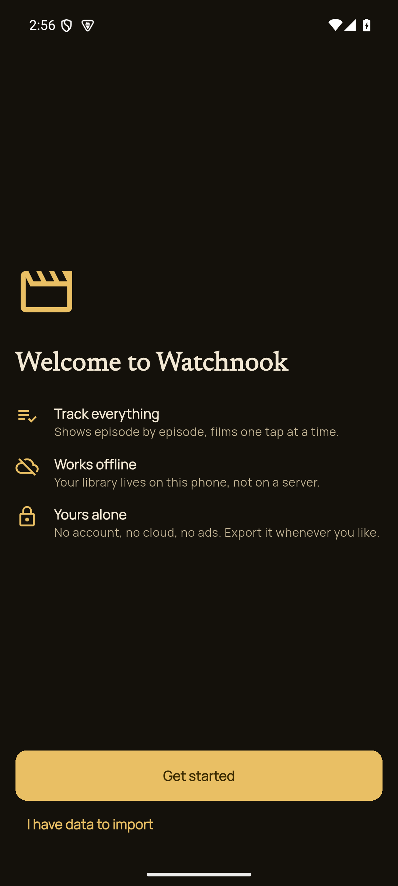
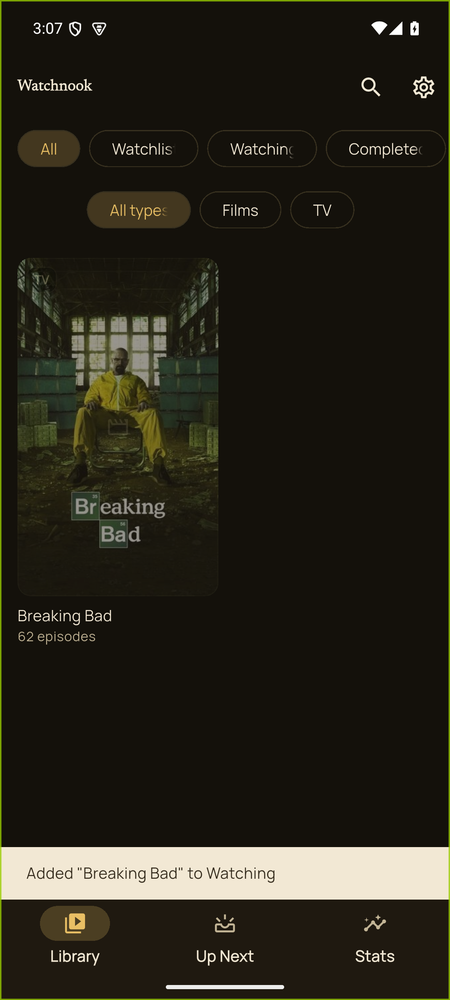
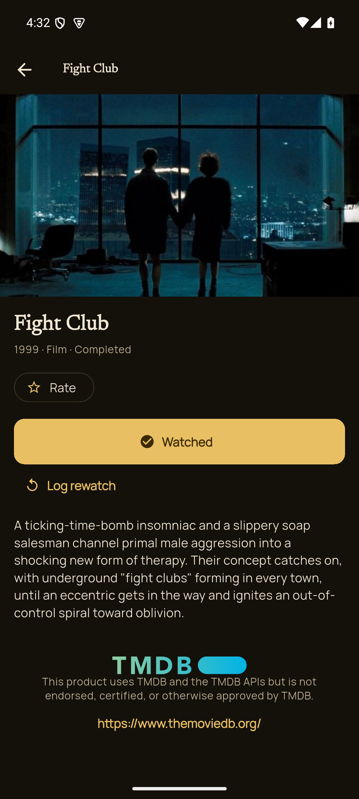
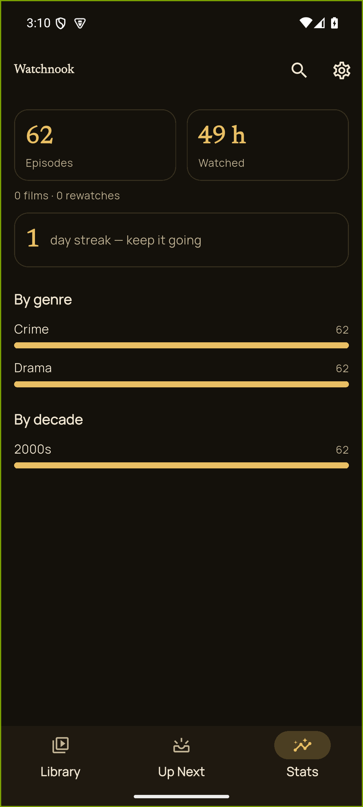

# Watchnook

**A local-first, backend-free Android TV & movie tracker.** Track what you're watching and what's
next, mark episodes and films watched (with bulk actions), see upcoming episodes, and import from the
services you already use. No accounts, no ads, works offline — built to replace **TV Time**.

<p>
  
  
  
  
</p>

## Features

- **Track TV & movies** with a status (watchlist / watching / completed / on-hold / dropped).
- **Mark watched / unwatched** per-episode or in **bulk** (whole season/show), with **rewatch** logging.
- **Up Next** — this week's episodes for the shows you track.
- **Import** your history from **TV Time, Trakt, IMDb, or Letterboxd** — clean matches auto-resolve,
  ambiguous ones you confirm, and importing **merges** (never wipes your history).
- **Export** portable **JSON** + a **Letterboxd CSV**, plus **Android Auto Backup**.
- **Stats** — episodes, hours, by genre & decade, streaks.
- **Local-first & offline** — your library lives on your device (SQLite); the only network call is a
  metadata API for titles, artwork, and air-dates.
- No accounts, no ads, no tracking, no social.

## Install

**From GitHub Releases:** download the latest `app-release.apk` from the
[Releases page](../../releases), enable *"install unknown apps"* for your browser/file manager, and
open the APK. Updates install in place (releases are signed with a stable key).

_F-Droid support is planned._

## Build from source

1. Install **[Flutter 3.44.0](https://docs.flutter.dev/get-started/install)** + the Android SDK, and
   [`just`](https://github.com/casey/just).
2. Get a **free TMDB API key** at <https://www.themoviedb.org/settings/api>.
3. Copy the example secrets file and add your key (the shape is **flat**):
   ```bash
   cp secrets.json.example secrets.json
   ```
   ```json
   { "activeSource": "tmdb", "tmdbApiKey": "<your TMDB v3 key>", "tmdbReadToken": "", "tvdbApiKey": "" }
   ```
4. Build:
   ```bash
   just build-debug                                                   # debug APK
   flutter build apk --release --dart-define-from-file=secrets.json   # release APK
   ```
   The output APK is at `build/app/outputs/flutter-apk/`.

> The prebuilt release APK bakes in a shared TMDB key that is **public by design** — TMDB rate-limits
> per-IP, not per-key, so a shared key is safe. To use your own instead, put it in `secrets.json` and
> rebuild.

See **[CONTRIBUTING.md](CONTRIBUTING.md)** for the dev workflow, and
**[docs/ARCHITECTURE.md](docs/ARCHITECTURE.md)** + **[docs/PRD.md](docs/PRD.md)** for the design.

## Tech stack

Flutter (Android-first, Material 3) · **Riverpod** (state) · **Drift**/SQLite (on-device DB) ·
**go_router** (navigation) · **TMDB** (or TheTVDB v4) for metadata via a swappable `MetadataSource` ·
`cached_network_image` · `google_fonts` (Newsreader + Manrope).

## Attribution

Metadata and artwork are provided by **[The Movie Database (TMDB)](https://www.themoviedb.org/)**.
This product uses TMDB and the TMDB APIs but is **not endorsed, certified, or otherwise approved by
TMDB**.

## License

[MIT](LICENSE) © 2026 Stuart Bradley.
